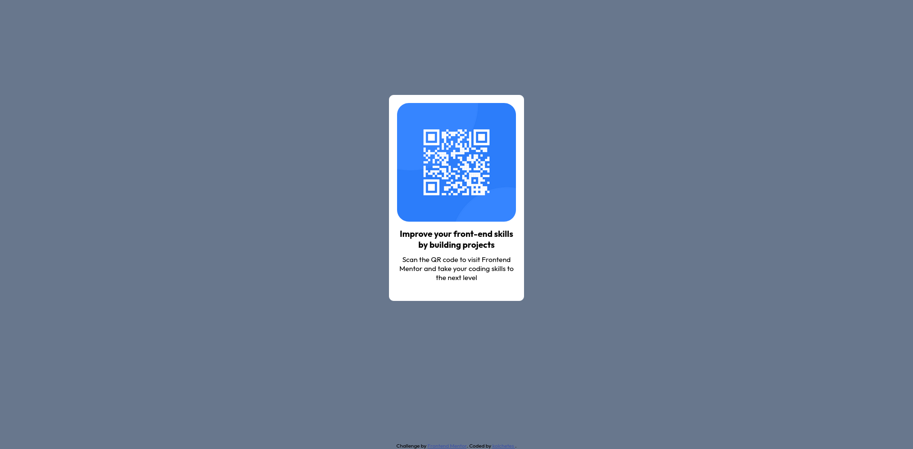

# Frontend Mentor - QR code component solution

This is a solution to the [QR code component challenge on Frontend Mentor](https://www.frontendmentor.io/challenges/qr-code-component-iux_sIO_H). Frontend Mentor challenges help you improve your coding skills by building realistic projects. 

## Table of contents

- [Overview](#overview)
  - [Screenshot](#screenshot)
  - [Links](#links)
- [My process](#my-process)
  - [Built with](#built-with)
  - [What I learned](#what-i-learned)
  - [Continued development](#continued-development)
  - [Useful resources](#useful-resources)
- [Author](#author)

## Overview

A QR Code Webpage

### Screenshot

### Links

- Solution URL: https://your-solution-url.com
- Live Site URL: https://kolchetes.github.io/qr-code-component/

## My process

It was a pretty easy webpage, all I had to do was write some simple HTML and put it inside a
container to make a card with CSS.

### Built with

- Semantic HTML5 markup
- CSS custom properties
- Flexbox
- Mobile-first workflow

### What I learned

I didn't learned anything new to be honest, but it was a nice warm up project. I gave up on learning to code, now I'm comnig back =)

### Continued development

My goal is to keep practicing web development focusing on semantic html and mobile first css. 

### Useful resources

- [Resource 1](https://www.aleksandrhovhannisyan.com/blog/62-5-percent-font-size-trick/) - A cool trick to keep in track with "rem" font size.

## Author

- GitHub - [kolchetes](https://github.com/kolchetes)
- Frontend Mentor - [@kolchetes](https://www.frontendmentor.io/profile/kolchetes)
- Bluesky - [@kolchetes.bsky.social](https://bsky.app/profile/kolchetes.bsky.social)

